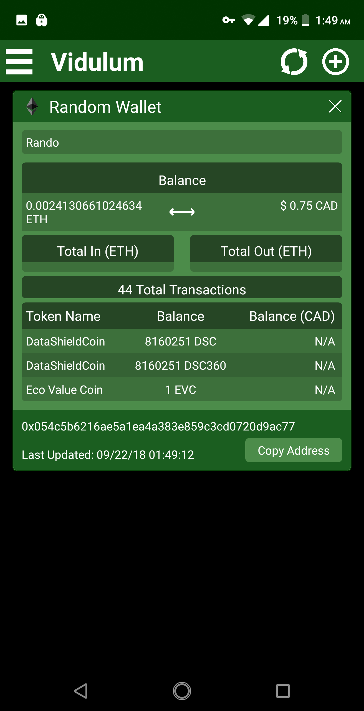

	

NOTE: This has no relation to the other crypto currency wallet app of the same name

# Vidulum: Crpytocurrency Wallet Checker
The purpose of this application is to provide a quick and easy "at a glance" view of any bitcoin or Ethereum wallet. This app uses various APIs such as [Ethplorer](https://ethplorer.io/), [Coin Market Cap](https://coinmarketcap.com/), [Block Explorer](https://blockexplorer.com/), and [Bitcoin Chain](https://bitcoinchain.com/) as well as back end APIs written by myself which are included in this repo. 

## Main Screen

The main screen of Vidulum features an at a glance view of an added wallet. The user can then choose to view more in depth information by simply tapping the title of the wallet. Here the user is able to view in depth information such as transaction history or even token balances in the case of Ethereum.

	

	
	

## Accounts

One of the main features of this app is the ability to create an account. This allows the user to easily backup and restore their wallet list across any device.

	

## Screen Lock

One of the biggest concerns in modern life is security. This is especially true when it comes to personal finances. While all of this information is publicly available some would still rather keep it private so as not to match wallets to themselves. Due to this the screen lock feature allows a user to keep the entire contents of the app private.

	

## Themes

While all of the content talked about previously is functionally based this feature is purely cosmetic. This allows the user to change the look and feel of the application with the choice between various fees (more than what's pictured below).

	
	

	

## Feedback

I have a philosophy that everything can be improved upon. The only problem is is in a lot of cases I have no idea what those improvements are. To help with this a feedback page has been included in which the user can send any message to me with the option of a reply from myself.

	

